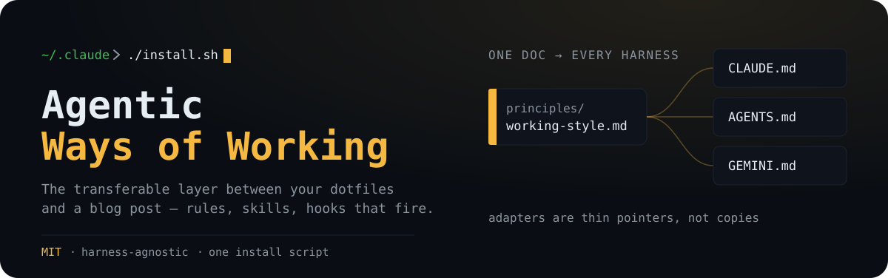
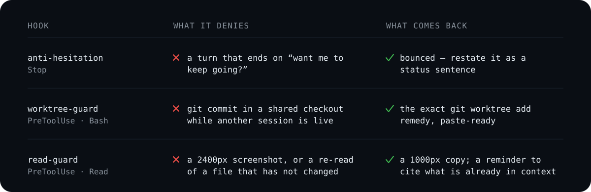

<p align="center">
  
</p>

There are two honest ways to share how you work with AI, and both are incomplete.

You can publish your dotfiles — but those carry your secrets, your machine paths, and a corpus of your own prompts. What ships isn't a method; it's a fingerprint. Or you can write the essay — the principles, the philosophy, the "here's how I think about agents" post. That travels anywhere, and installs into nothing.

This repo is the layer between: the rules an agent actually reads, the skills it actually runs, the hooks that actually fire. Extracted from a private cross-machine setup and stripped of everything that was *me* rather than *method*. Clone it, run one script, and the same working stance is enforced in your own sessions tonight.

## Principles are prose. These have teeth.

Most "how I work with AI" material is advice you have to remember. The difference here is that the highest-value rules are wired to hooks that fire whether or not the model cooperates.

<p align="center">
  
</p>

All three fail open: an uncertain hook allows the action rather than blocking your work. The two `PreToolUse` guards also take a per-scope escape hatch — a `.guard-off` file — when you need them out of the way entirely.

## Install

```bash
git clone https://github.com/nino-chavez/agentic-ways-of-working.git
cd agentic-ways-of-working
./install.sh            # symlinks into ~/.claude, wires hooks, backs up settings.json
# ./install.sh --copy   # copy instead of symlink, if you'd rather not track this repo
```

Idempotent and reversible: it backs up `settings.json` before touching it, only adds hook registrations that aren't already present, and symlinks by default so `git pull` updates everything in place. It won't overwrite your existing rules file — that one line is left for you to run deliberately, and it prints the command.

Then restart your session so the hooks load.

The installer currently targets Claude Code. For Codex, point `AGENTS.md` at [`adapters/AGENTS.md`](adapters/AGENTS.md) and link the skills you want into `~/.codex/skills/`; the [session-retention guide](docs/session-retention.md#install-the-closeout-skill) includes the exact command for `session-closeout`.

## One doc, every harness

Every harness wants its own rules file. Claude Code reads `CLAUDE.md`. Codex reads `AGENTS.md`. Gemini reads `GEMINI.md`. The naive move is to maintain three copies and watch them drift until they quietly disagree about how you work.

So there's exactly one canonical doc — [`principles/working-style.md`](principles/working-style.md) — and each harness gets a thin [adapter](adapters/) that points at it. Edit the principles once; every tool picks up the change on its next read. The principles themselves assume nothing about which model is driving.

| Principle | What it changes | Enforced by |
|---|---|---|
| **Default to action** | One "go" covers the thread. Turns end on a status sentence, not a permission check | [`anti-hesitation.py`](hooks/anti-hesitation.py) |
| **Worktree isolation** | Parallel sessions never share a checkout, so commits can't land on each other's branch | [`worktree-guard.py`](hooks/worktree-guard.py) |
| **Token economics** | Session hygiene beats payload trimming; subagents are context firewalls | [`read-guard.py`](hooks/read-guard.py) + [statusline](statusline.py) |
| **Session retention** | Promote durable truth before raw transcripts expire; lifecycle hooks enqueue and background workers mine | [`session-closeout`](skills/session-closeout/SKILL.md) + [retention pattern](docs/session-retention.md) |
| **Harness hygiene** | Know what loads, what's used, and what's backed up before it disappears | [`/doctor`](commands/doctor.md) |
| **Canonical-pattern-first** | Read the vendor's approach before hand-rolling auth, payments, or webhooks. Custom shapes name their disqualifier | judgment |
| **Calibrate rigor to stakes** | The bar comes from who depends on the work, not from where the file sits | judgment |
| **Prose voice, no fabrication** | Human-facing prose loads the voice guide first, and never invents an interior state the author didn't have | judgment |
| **Secret handling** | Secrets live in a manager; check for an existing entry before inventing a name | judgment |

The judgment rows are deliberate. A hook can see a tool call; it can't see intent, so those rules live in prose where the model applies them.

### Three of these came from measurement, not opinion

**Token economics.** The agent API is stateless — every tool call replays the whole conversation, so a payload's cost is its size times the turns that follow it. Measured on a real 60-day corpus: a **41× replay multiplier**, which makes session cost roughly quadratic in turn count. Three of four starting hypotheses were wrong. The prime suspect, web fetches dumping raw HTML, was innocent in all 873 of them; the actual drivers were session length and full-page screenshots re-read dozens of times. Run [`tools/token-audit.py`](tools/token-audit.py) against your own logs before optimizing anything ([method](docs/token-audit.md)).

**Session retention.** One Codex home directory reached roughly **24 GB**, split between 18.5 GiB of reproducible worktree output and 5.04 GiB of archived transcripts. Mining 605 transcripts produced a 34 MB recall database, but ingestion could not prove that every project-specific lesson had moved into its owning repository. The [`session-closeout`](skills/session-closeout/SKILL.md) skill makes that semantic gate explicit; the [retention pattern](docs/session-retention.md) keeps hooks fast, provenance attached, and deletion behind a current watermark plus human judgment.

**Harness hygiene.** The harness rots two ways: bloat that accumulates, and good tooling that quietly disappears because it was never version-controlled. Both turned up in the same audit — a working harness-cleaner command was built, ran successfully, and vanished within four days, and a dozen more extensions were found sitting in that identical unbacked state. [`/doctor`](commands/doctor.md) maps the whole harness read-only and applies nothing without confirmation, including a check for whether each extension it finds is backed by version control at all.

## What's in the box

```
principles/working-style.md   The canonical doc. Harness-agnostic. Start here.
adapters/                     Thin pointers: CLAUDE.md, AGENTS.md, GEMINI.md
skills/                       The methodology suite (see below)
commands/campsite.md          /campsite — toggle the north-star working stance
commands/doctor.md            /doctor — health-check and clean up your own harness
hooks/                        anti-hesitation, campsite, blueprint-session-start, worktree-guard, read-guard
git-hooks/                    Local post-commit Claude review on commits worth reviewing
tools/token-audit.py          Measure where your sessions actually spend tokens
statusline.py                 Context-usage statusline — the /clear signal
docs/                         Analysis & essays — token audit, session retention, substrate convergence
install.sh                    Symlinks it all into ~/.claude and wires the hooks
```

### Skills

The craft skills are self-contained — drop them in and they work:

| Skill | What it does |
|---|---|
| `campsite` (command + hook) | Toggle "leave it better than you found it": no shims, fix-as-discovered, touched files end clean |
| `deepen` | Find architectural deepening opportunities (Ousterhout's depth/seam vocabulary, the deletion test) |
| `symbol-surgery` | Symbol-first refactoring on the native LSP tool: locate by symbol, check blast radius, edit at boundaries, verify references (executes what `deepen` decides) |
| `diagnose` | Disciplined hard-bug loop: reproduce → minimise → hypothesise → instrument → fix → regression-test |
| `grill-with-docs` | Stress-test a plan against your domain model and documented decisions |
| `tdd` | Red-green-refactor with deep-module and mocking guidance |
| `triage` | Move issues through a state machine driven by triage roles |
| `ship` | Deterministic deploy: reads a per-project `DEPLOY.md` as source of truth |
| `session-closeout` | Promote durable lessons, name unresolved evidence, and issue an archive-safety receipt |
| `zoom-out` | Pull up from the diff to the system before committing to a direction |
| `write-a-skill` | Author new skills with progressive disclosure and bundled resources |

The `blueprint-*` suite (`research`, `prototype`, `docs`, `validate`, `deploy`, `dispatch`, `triage`, `handoff`, `amendment`) encodes a brownfield-redesign methodology — diagnose current state, prescribe, prototype the proposed state. These are the most opinionated artifacts here and they pair with a separate Blueprint methodology repo; point `BLUEPRINT_HOME` at your clone of it. Take them as a worked example of how far a methodology can push into skills, not as a turnkey drop-in.

### Git hooks

The Claude Code hooks above fire inside a session. [`git-hooks/`](git-hooks/) is the other direction: a git `post-commit` hook that runs a focused Claude review *after* a commit — but only on the commits worth it (a configurable line threshold, or a touched sensitive path like `auth/` or `*.sql`). It's the local-first answer to a PR-gated review action: no PR required, async so the commit returns instantly, and billed to your Claude subscription rather than a metered API key (it unsets `ANTHROPIC_API_KEY` before calling `claude`). Merge commits and rebase replays are skipped so a ten-commit rebase doesn't fan out ten reviews. Self-contained with its own `install.sh` — see [`git-hooks/README.md`](git-hooks/README.md).

## In practice

**Campsite Mode raises the bar, per project.** Turn it on when you want north-star-only work — no shims, fix-as-discovered, touched files end clean:

```bash
/campsite on      # → "Campsite Mode ON — north-star only, fix-as-discovered, touched files end clean."
# ... pre-existing defects in files you touch get fixed in the same change ...
/campsite off     # → back to scoped, surgical edits
```

The flag lives at `<project>/.claude/campsite-mode`, so each repo opts in independently.

**Skills fire on intent, not ceremony.** You don't memorize commands — describe the work and the matching skill engages:

```
"this test is flaky and I can't reproduce it"     → diagnose   (reproduce → minimise → instrument → fix)
"does this module actually pull its weight?"      → deepen     (depth/seam/locality, the deletion test)
"ship it"                                         → ship      (reads the project's DEPLOY.md, executes)
"stress-test this plan against our domain model"  → grill-with-docs
```

Point Codex at `adapters/AGENTS.md` or Gemini at `adapters/GEMINI.md` and the decision-bias, canonical-first, and worktree rules travel unchanged.

## What's deliberately not here

The personal layer. No voice corpus, no recall database, no secrets, no machine paths, no project-specific context. Those are what made the private version *mine*; none of them would make the public version *yours*. If a skill or hook references a path that doesn't exist in your setup, it degrades quietly rather than failing — that's intentional.

This is a snapshot of a working method, not a finished standard. The principles have been revised more times than the commit history will show, and they'll keep moving. Fork it, cut the parts that don't fit how you think, and let the rest earn its place.

## License

MIT — see [LICENSE](LICENSE).
